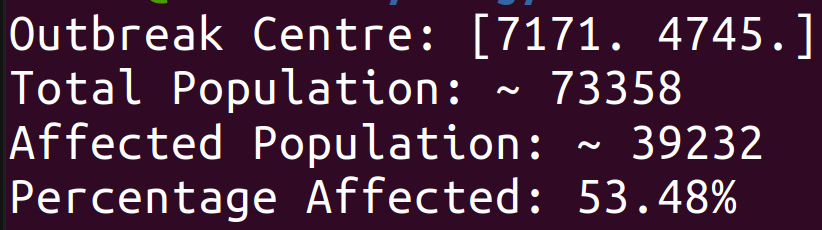
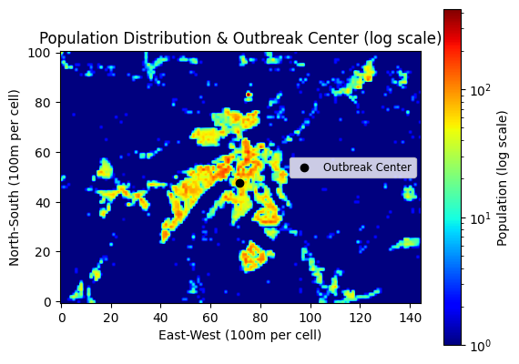

# Outbreak Analyser

This project provides a simulation tool for analysing the outbreak of infectious diseases based on reported cases and a gridded representation of the population.

## Table of Contents

- [Introduction](#introduction)
- [Features](#features)
- [Getting Started](#getting-started)
  - [Prerequisites](#prerequisites)
  - [Installation](#installation)
- [Usage](#usage)
- [Model Output](#model-output) 
- [Plot](#plot)
- [Future Extensions](#future-extensions)
- [License](#license)
- [Author](#Author)

## Introduction

The Outbreak Analyser is a Python-based tool designed to simulate and study the dynamics of an infectious disease outbreak within a population. By utilizing reported cases and population data, the tool determines the outbreak center, calculates affected populations, and visualizes the population distribution.

### Problem to Solve

In the context of infectious diseases, understanding the spatial and population dynamics of an outbreak is crucial for effective public health planning. This tool addresses key questions such as:

1. **Outbreak Center:** Where is the center of the outbreak, and what is the impact on the surrounding population?

2. **Affected Population:** What percentage of the population is affected by the outbreak?

3. **Population Visualization:** How can we visualize the population distribution and the outbreak center?

### Features

- Analysis of infectious disease outbreaks based on reported case locations and population distribution.
- Determination of the outbreak center.
- Calculation of affected population and percentage.
- Visualization of the population distribution with the outbreak center.


## Getting Started

To get started with the Outbreak Aanalyser, follow these steps:

### Prerequisites

Before running the model, make sure you have the following installed:

- [Python](https://www.python.org/) (>=3.6)
- [NumPy](https://numpy.org/)
- [Matplotlib](https://matplotlib.org/)

### Installation

1. Clone the repository:

   ```bash
   git clone https://github.com/babak2/outbreak_analyser.git

Navigate to the project directory:

`cd outbreak_analyser`

## Usage

If Python 3 is the only Python version installed on your machine, you can use the python command. For example:

```python outbreak_analyser.py ```

If both Python 2 and 3 are both installed, it's important to specify Python 3 using the python3 command. For example:


```python3 outbreak_analyser.py ```


## Model Output

After running the outbreak_analyser, you can expect to see the following output in the console:




These values provide information about the outbreak, including the geographical centre, total population, affected population, and the percentage of the population affected. 

This information is important for understanding the impact and scope of the simulated outbreak.


## Plot

The plot of result will be saved as in the output directory (default name is outbreak_plot.png). 


## Future Extensions

- **Data Input:** Allow the program to read data from external sources, such as real-world case data.
- **Customizable Output Formats:** Provide options to export model results in various formats for further analysis and reporting.
- **Statistical Analysis:** Incorporate statistical analysis tools to provide confidence intervals or uncertainty estimates for the simulation results.
- **Sensitivity Analysis:** Implement sensitivity analysis to identify the most influential parameters and understand the robustness of the model.
- **Calibration with Real-world Data:** Calibrate the model parameters using real-world epidemiological data to ensure that the simulation closely aligns with observed patterns of disease spread.
- **Interactive Visualization:** Create interactive visualization to explore better the dynamics of the outbreak.
**- Geographical Visualization:** Enhance visualization capabilities to include geographical maps with overlays of disease spread, population density, and other relevant information. 
- **GIS Integration:** Integrate with Geographic Information System (GIS) data to obtain real-world geographical features such as roads, population density, and healthcare facilities.
- **Intervention Strategies:** Implement different intervention strategies, such as vaccination campaigns, social distancing, or lockdowns, and analyze their impact on the spread of the disease.
- ...

## License

This project is licensed under the MIT License - see the [LICENSE](LICENSE) file for details.


## Author 

Babak Mahdavi Ardestani

babak.m.ardestani@gmail.com